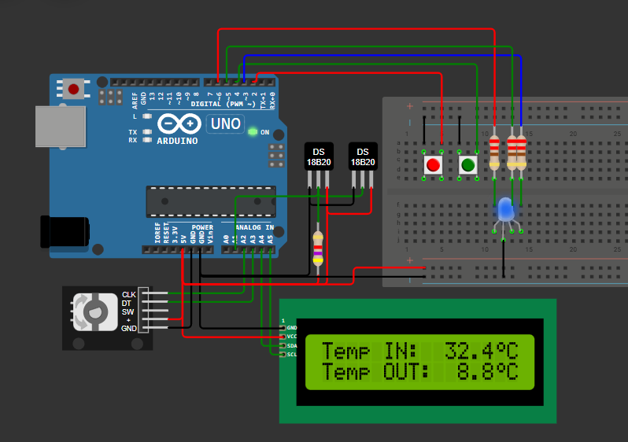
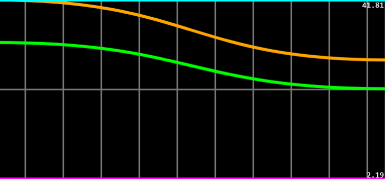

# Temperature Monitoring Station (Arduino UNO)
Simple temperature monitoring system for Arduino, created during academic classes (tested on physical setup). For me this was mainly an attempt to learn organisation of embedded C++ code.

## Features
- non-blocking execution (no `delay`)
- simple menu displayed on LCD, with two views:
    - `IN`/`OUT` temperature readings
    - `Min`/`Max` temperature
- menu controlled with encoder (interrupt attached)
- button debouncing (organised with `struct`)
- serial output for plotting `IN`, `OUT`, `Min`, `Max` temperature values
- RGB red indicating temperature comfort range

## Built With:
- C++
- Arduino framework
- OneWire and DallasTemperature libraries
- I2C

## Screenshots
All screenshots are from Wokwi Simulator.

Serial plot
